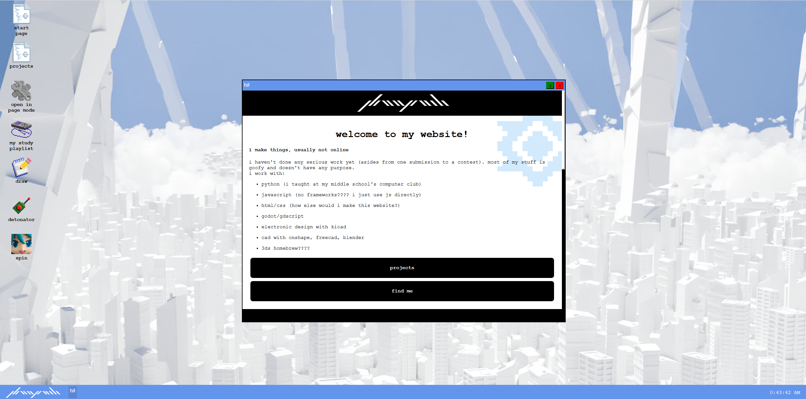
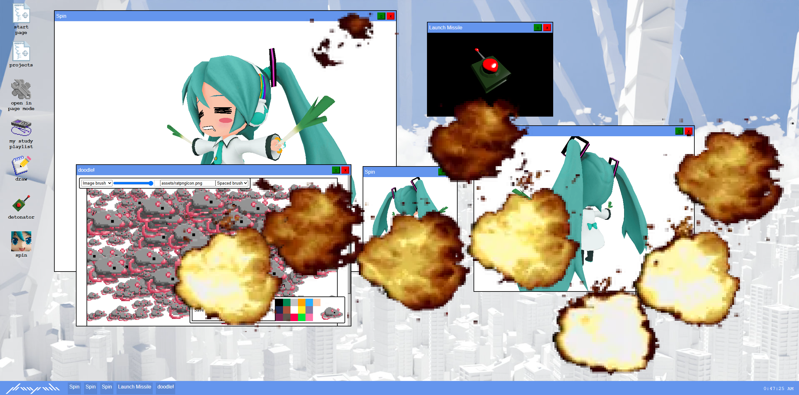

# haoyanli.dev / haohaohaoyan.github.io

a personal website that does a few things: 
- a gallery for my projects
- a way to find things i've done
- a place to put super small programs that i don't think deserve their own repo
- yap about myself and hyperfixate on random things
- a web fidget toy
- something i can look at and say is mine

this website used to be WAY more bland but i decided to redo it and hopefully make it somewhat more "fun". i wanted a website that was interactive and entertaining, that would serve more of a purpose than just a brag sheet. 
so far that's been going quite well and i've been having fun developing stupid little apps and my friends have been having fun being forced to test them!

## what's in here?
it's webOS styled, so it's essentially navigated like any operating system. (there's also a regular page-based viewing method, but that's pretty clunky. i haven't gotten to better support yet.)
"pages" are organized into windows, which can be dragged around, set to fullscreen, and closed. there's supposed to be a minimize button, but that's still a work in progress and will be finished alongside the dynamic z-ordering. 
there's pretty much a tutorial on what you can do inside the website itself. the desktop has app shortcuts that can open things, including fun scripts or little goofy things. the website should have a similar navigating experience to
most operating systems, so hopefully users will have fun with an environment they're mildly familiar with.
i hope that people enjoy using it, really. 

## "tech stack":
- html for everything frontend
- css, so it looks good
- vanilla js. i'm too lazy to learn a framework but jquery's shortened queryselectors are quite enticing
- three.js for the few 3D models used
- aseprite for icons, blender for models & wallpaper, affinity for some graphics & compression

## how it was made
i have a dedicated page to this on the websites, through the project showcase. heck, most of the things that are supposed to be on a readme are on there instead. 
either way here's some interesting methods i used to create things:
- the window content is displayed through an iframe! this makes it super easy to make new pages (they're just independent html files), but communication between dom and iframes is pretty bad.
- since iframe content can be accessed by parent dom but not the other way around, references to any necessary elements are created when the window is created and they're garbage collected after window is gone
- some things (like the missile launcher) require a script that runs on the base dom page, so there's an element that has the id "scriptreq". the window creation function checks for the existence of this 
and creates a script that has a reference to the window in a data attribute. when the window is closed, the function for that queryselectors for all elements that are linked to it (have its unique id in their data-window attribute) 
and deletes those too.
- the wallpaper was made in a single weekend, through the power of like 5 million buildings created through geometry nodes! the buildings are randomly placed, rotated, & scaled (might have to change to mimic a more normal city layout, 
this looks super cool though), the giant sky pillar things are too, and the background clouds were made through the easyclouds addon! i couldn't get mist compositor effect to work properly on the clouds, so instead a huge transparent plane 
is placed there.
- 

## problems i've yet to solve
- fix dragging windows being really slow because browser has to redraw every time. throttle/change to css transform?
- create separate script on base dom to import, cache, and serve 3D models to avoid having to redownload them every time

# work history:
see the version history in the website itself but summarized:
- an update on jul 28/29 2026 (submitted before i went to bed): added some more apps (a missile launcher, drawing application, and spinning miku)! redid the icons to be 32x32 (this will be the standard going forward) and
did some work in three.js for fun! also fixed a bunch of bugs, specifically not being able to resize the starting page (false advertisement...) and compressing the wallpaper to 1/10th of its old size without any noticeable
quality difference! the old wallpaper is still there as wallpaper_full.png but it won't be loaded by the browser. this update was for hack club's horizons polaris hackathon, specifically so i could get hotel rooms in toronto!
- second major revision on apr 29, 2026: this was done for hack club's flavortown (got an esp32 kit, orpheus pico, & pico 8 license!). i completely revamped the website into a webOS because i really thought that the old 
website was boring and didn't align with my ideal website: something full of personality and interactivity. this one started with the start page, projects, contacts, and project pages. i scrapped the blog 
because i wasn't gonna keep up with it anyway.
- first version on sep 6, 2025: i wasn't in hack club yet, this version of the site was INCREDIBLY basic and had a main page with my contacts, two project pages, and a blog (that i forgot about after october)

## no ai was used. this is MY website, not claude's or chatgpt's. i'm part of the no-ai webring too